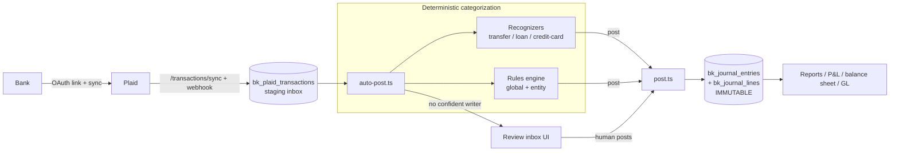
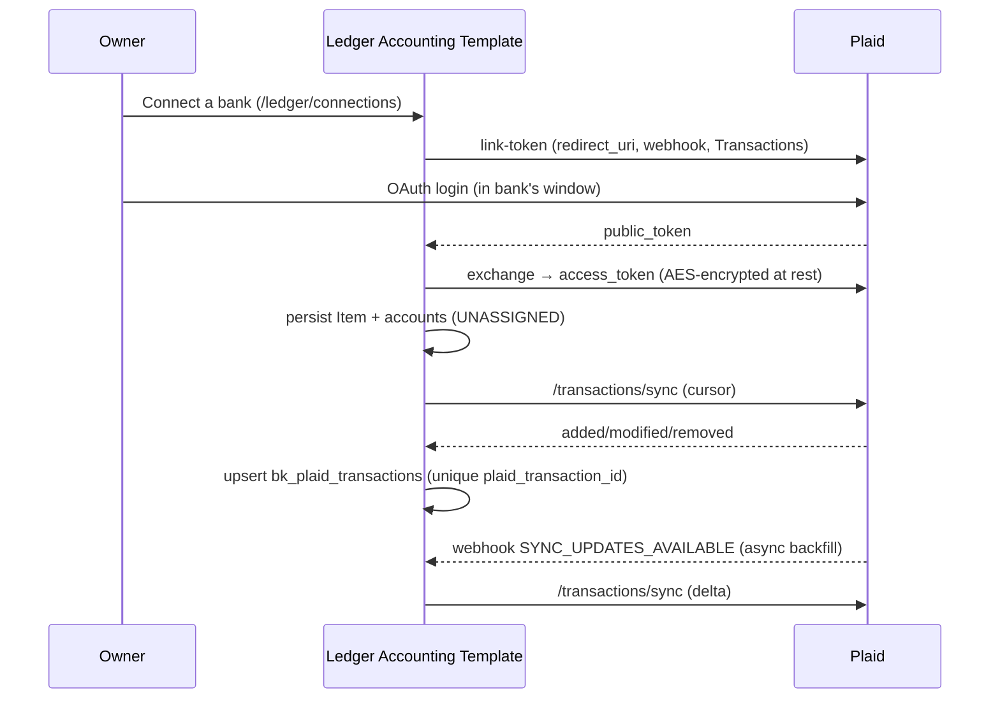
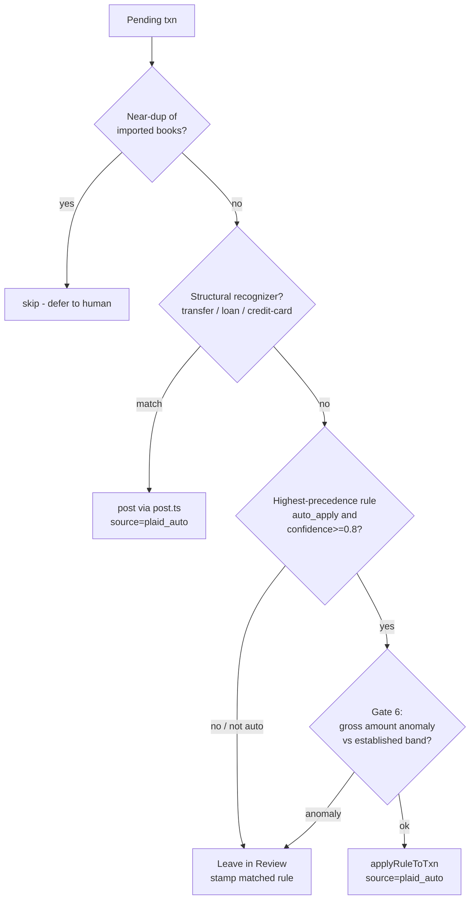
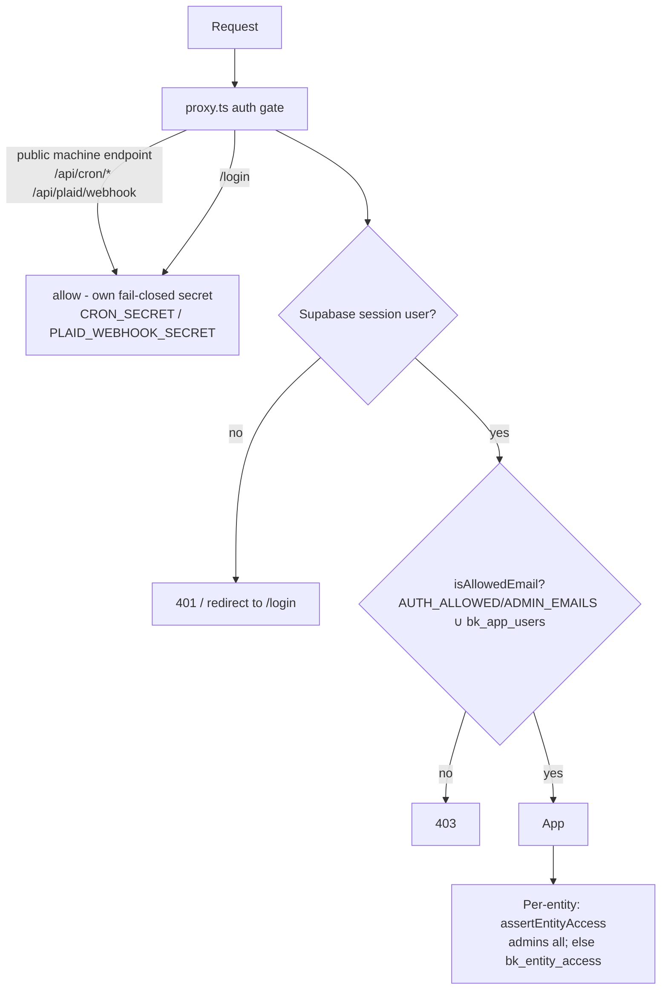
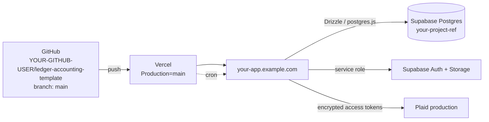

# Architecture — Ledger Accounting Template

Technical reference for the codebase. Explains **how** the system works and
**why** it's built this way. Pair with `DECISIONS.md` (the decision log). For
onboarding basics see `/CLAUDE.md`.

---

## 1. System overview

Ledger Accounting Template is a multi-entity, double-entry bookkeeping system. Bank
transactions arrive via Plaid, are categorized deterministically, and post into
an immutable general ledger.

**Design intent:** the LLM understands and suggests; **deterministic code moves
the money.** Nothing debits/credits an account without either a structural
recognizer or a rule the owner trusts. Every decision is auditable.

---

## 2. Database

Supabase Postgres, accessed two ways:
- **Drizzle over `postgres.js`** (`lib/db/client.ts`) as the `postgres` role — the
  primary app path. This role **bypasses RLS** (`rolbypassrls`).
- **supabase-js service-role client** (`lib/supabase/server.ts`) — used only for
  Auth admin + Storage (documents). Also bypasses RLS.

23 tables in `public`, all `bk_`-prefixed (3 of them dormant — see below). **Every table has RLS enabled and the
`anon`/`authenticated` PostgREST roles revoked** — the app never uses those roles,
so the public API is deny-all. New tables must ship this way (see § 12).

### Core groups

| Group | Tables | Purpose |
|---|---|---|
| Entities & COA | `bk_ledger_entities`, `bk_accounts` | The businesses and their chart of accounts |
| Ledger | `bk_journal_entries`, `bk_journal_lines`, `bk_journal_edits` | The immutable double-entry journal + edit audit |
| Bank feed | `bk_plaid_items`, `bk_plaid_accounts`, `bk_plaid_transactions` | Plaid login, accounts, staging inbox |
| Rules | `bk_rules`, `bk_categorization_events`, `bk_rule_edits` | Categorization rules + decision log + change log |
| Reconciliation | `bk_reconciliations` | Bank reconciliation marks |
| Products | `bk_loans`, `bk_documents`, `bk_valuation_components`, `bk_valuation_estimates`, `bk_category_batches`, `bk_wave_imports` | Loans/amortization, document storage, property valuation, AI batch tracking, Wave import history |
| Dormant | `bk_notes_receivable`, `bk_invoices`, `bk_invoice_templates` | REMOVED feature (invoicing/statements, 2026-07): tables + data remain in the DB, RLS-locked, referenced by no code. Dropping them is an optional future migration — owner approval required |
| Access | `bk_app_users`, `bk_entity_access` | Login allowlist + per-entity permissions |

Schema is declared in `lib/db/schema.ts`. **Migrations are hand-run idempotent
scripts** (`scripts/add-*.mjs`), not `drizzle-kit push` — see § 12 for why.

### Entity model

`bk_ledger_entities` — one row per business (LLC). Key columns: `id`, `name`
(display), `legal_name`, `realm_id` (unique per-entity key; used to key an entity to its imported books,
just a unique key), `tax_type`, valuation fields. (`qbo_sync_enabled` is a
dormant column — the toggle UI and all reads were removed 2026-07.)
**No entity facts are hardcoded in code** — everything is data.

### Ledger / journal model

Double-entry. A `bk_journal_entries` row (header: entity, date, name/payee, memo,
`total_cents`, `source`, `raw_qbo` = the source Plaid/import object) owns ≥2
`bk_journal_lines` (each: account, `debit_cents`, `credit_cents`, `line_memo`).
Every entry balances (Σdebit = Σcredit).

`source` ∈ `plaid` (human posted a Plaid txn) · `plaid_auto` (unattended
auto-poster) · `qbo_import` / `wave_import` (historical import — **data lineage**)
· `manual` · structural-recognizer sources. **The journal is append-only:**
corrections are new entries; `unpost` deletes only `plaid`/`plaid_auto` entries.

### Chart of accounts

`bk_accounts` — per-entity accounts (`entity_id`, `name`, `account_type`,
`account_subtype`, `classification` ∈ asset/liability/equity/revenue/expense,
`normal_balance`, `qbo_account_id`). Charts differ per entity (imported from
imported CSVs), which is exactly why the **canonical account layer** exists (§ 6).

---

## 3. Bank sync flow (Plaid)

**One login = one Plaid Item** (`bk_plaid_items`). Each **account**
(`bk_plaid_accounts`) is the unit of ownership: it is assigned to an entity and
mapped to a ledger bank account. Transactions land in `bk_plaid_transactions`
(status `pending_review` | `posted` | `ignored` | `already_booked`), stamped with
the account's entity (null = unassigned → not in any inbox).

Sync is **cursor-based** (`bk_plaid_items.txn_cursor`), upserts on the unique
`plaid_transaction_id`, so it's an idempotent delta. The webhook (item-level,
gated by the dedicated `PLAID_WEBHOOK_SECRET`) is the real-time trigger; the
daily cron is the backstop.

**Why one-Item-many-accounts:** a Chase login can hold many accounts across many
entities. Re-linking with a different account selection would spawn a duplicate
Item (and some banks invalidate the old one), so `exchange` **hard-blocks a second
active Item for the same institution** (409) and steers to **Update Mode**
(`account_selection_enabled`) to add accounts to the existing Item.

---

## 4. Auto-post pipeline

`lib/plaid/auto-post.ts` `autoPostEntity(entityId)` — the unattended writer. Runs
in REAL TIME from the Plaid webhook (after each Item sync, per affected entity,
isolated so a failure never blocks the ack), from the daily cron
(`/api/cron/auto-categorize`, the backstop), and from the "Auto-post known
matches" button. Precedence, per pending transaction:

- **Recognizers first** — they produce correct *multi-line* structural entries
  (a transfer books once and ignores its counterpart; the LIABILITY ENGINE
  splits loan payments into principal/interest/escrow from CURRENT STATE:
  GL balance × rate/12 interest, escrow as the residual — see ADR-017 and
  lib/plaid/loan-match.ts). A flat category rule would mis-book these.
- **Rules second** — only `auto_apply` rules above the confidence bar post.
- **Gate 6** (`lib/rules/outlier.ts`) is now **automation-first**: a first-time
  merchant posts, an unfamiliar account posts; only an amount **>8× / <⅛** an
  *established* merchant band still defers (likely typo/fraud). (Was "when in
  doubt review" — see DECISIONS.md ADR-011.)
- Everything auto-posted is `source='plaid_auto'` → flagged in the UI, one-click
  reversible (`unpost`), and logged to `bk_categorization_events`.

---

## 5. Rules engine (`lib/rules/`)

Deterministic, user-authored, auditable categorization.

- **`bk_rules`:** `scope` (`global` ⇔ `entity_id IS NULL`), `predicate` (jsonb
  `ConditionGroup`), `action` (jsonb `ActionSpec`), `auto_apply`, `enabled`,
  `status` (`active`/`proposed`/`archived`), `rank`, `applied/corrected/confirmed_count`.
- **Predicate** — `all`/`any`/`not` groups over fields (`merchant`, `rawName`,
  `amountCents`, `direction`, `plaidCategory*`, `bankAccountSubtype`, day/weekday…)
  with string/number ops. `lib/rules/facts.ts` extracts facts; `predicates.ts`
  evaluates.
- **Action** — `categorize` | `split` | `leave_uncategorized` | `ignore` |
  `transfer` (reserved). Targets are `{by:'canonical', key}` or
  `{by:'account', accountId}`.

### Precedence (`engine.ts selectRule`)

Load = global (active+enabled) ∪ entity rules, sorted **entity-before-global →
`rank` asc → specificity desc → `created_at`**. First match wins. If 2+ match, the
sorted first is used (the auto-poster posts it — no longer defers). **Why global +
entity:** global rules encode portfolio-wide vendor→category knowledge once
(Airbnb→income, Comcast→utilities); entity rules override for the exceptions.

### Confidence, graduation, learning

- `ruleConfidence = (applied − corrected + 1)/(applied + 1)`, clamped [0,1].
  `meetsAutoBar = auto_apply ∧ confidence ≥ 0.8`.
- **Learning loop** (`learn.ts recordRuleOutcome`, run atomically with the ledger
  post): when the owner posts a rule-prefilled txn it's a **confirmation** or
  **correction**. A correction bumps `corrected_count` and **demotes** an
  `auto_apply` rule (it drops below 0.8 and stops posting). This demote-on-
  correction is the safety valve that makes aggressive auto-apply acceptable.
- **Graduation** (`GRADUATE_MIN_CONFIRMATIONS=3`) was the original "earn auto-apply"
  mechanism. Now mostly moot — new rules default `auto_apply=true` (ADR-011).
- **Learner** (`learner.ts`) proposes rules from booked history (`status=proposed`,
  disabled) for approval. (Auto-activation is a TODO.)

---

## 6. Canonical accounts & generic fallback (`lib/ledger/canonical-accounts.ts`)

**The multi-tenant resolution layer.** Each entity's idiosyncratic chart maps onto
a portfolio-wide taxonomy of `CanonicalKey`s (`income.airbnb`, `income.other`,
`expense.utilities`, `expense.insurance`, …). A **global rule targets a canonical
key**; at post time it resolves to *that entity's* concrete account.

- **RESOLVE** (`resolveCanonicalAccounts`, read-only) — scores each entity account
  against each key's name matchers (most-specific first, with exclusions), best
  match wins. Keys with no match are absent.
- **ENSURE** (`ensureCanonicalAccounts`, write) — for core keys, create an
  app-native account (`canon:<key>` id, sync-proof) when the entity has none.
- **Generic parent FALLBACK** (ADR-010) — a `CanonicalDef` may declare a
  `fallback` parent key. After direct resolution, any unmatched key inherits its
  parent's account (chain-followed, cycle-guarded). So a rule targeting
  `income.airbnb` still resolves for an entity that keeps only a generic "Rental
  Income": all rental channels fall back to `income.other`; `garbage` → `utilities`.
  **Why:** global rules must be portable across entities regardless of minor COA
  differences, with no per-entity rule copies. Categories with no *safe* generic
  parent (insurance, management…) deliberately have no fallback — they stay
  unmatched → human review rather than mis-post to a catch-all.

---

## 7. Duplicate prevention (correctness — never relax)

Three independent layers guard against double-booking:
1. **Within a connection:** the Plaid cursor + unique `plaid_transaction_id`
   upsert. A synced txn can't duplicate itself.
2. **Across connections:** `detectDuplicateAccounts` (institution + mask +
   subtype) warns at link time if an account is already connected elsewhere.
3. **Vs. already-booked history:** `matchBooked` (`lib/plaid/data.ts`) compares
   (mapped ledger account, |amount cents|, date) against `qbo_import`/`wave_import`
   bank lines — **exact ≤1 day** → auto-suppressed to `already_booked` (hidden).
   `post.ts` hard-blocks an exact import-dup even via the API. The boundary
   defense is the **pre-cutoff guard**: nothing dated on/before the entity's
   `imported_through` auto-posts (recognizer or rule) — it waits in Review with
   an explicit reason, because imported books can bundle payments into shapes
   amount-matching can't see (a real 2× mortgage entry defeated it in prod).
   The old ±3-day "near match" deferral was REMOVED for post-cutoff rows
   (owner decision 2026-07-02): recurring charges (Turnoverbnb cleanings)
   legitimately repeat identical amounts on consecutive days, so proximity
   after the cutoff was pure false-alarm.

Limitation (see TODO): there is **no per-account "import floor" watermark** — the
first sync pulls the full Plaid window and relies on `matchBooked` to hide the
overlap. Works cleanly when books end on a clear cutoff; a messy cutoff with
amount/date variance could slip a variant duplicate through.

---

## 8. Authentication & permissions

- **Supabase Auth** — email + password, admin-provisioned (no self-signup, no
  invite email). `proxy.ts` (renamed Next middleware) is the login gate; it uses
  the anon client only for `auth.getUser()`.
- **Two layers:** login allowlist (`AUTH_ALLOWED_EMAILS` ∪ `AUTH_ADMIN_EMAILS` ∪
  active `bk_app_users`), then per-entity access (`bk_entity_access`; admins see
  all) enforced in pages/actions/routes via `lib/ledger/access.ts` +
  `lib/rules/authz.ts`. DB-level RLS is *not* the enforcement layer (the app
  bypasses it); it's defense-in-depth against the public API.
- **Entity creation is owner-only** (`assertEntityCreator` in
  `lib/ledger/access.ts`): an identity check on the authenticated session email
  (`owner@example.com`), NOT a role check — admin/all-entity access never
  implies permission to create an entity. The `createEntity` server action is
  the authoritative guard; the `/ledger/new` page guard and hidden links are
  UX.
- **ID-based mutations are entity-scoped**: valuation components/estimates and
  Plaid account→ledger assignment verify the resource belongs to the authorized
  entity in the same query/transaction, and reject foreign ids with the same
  generic error as missing ones (no existence leak).

---

## 9. Background jobs (`vercel.json` crons)

| Cron | Schedule | Does |
|---|---|---|
| `/api/cron/auto-categorize` | daily `0 8 * * *` | `syncAllItems` (backstop) → ingest AI batches → **auto-post** (runs when ≥1 pending) → learner proposes → submit AI batch |

Gated by `Authorization: Bearer $CRON_SECRET`, checked **fail-closed** with a
constant-time compare (`lib/security/machine-auth.ts`) — an unset/blank secret
rejects every request. **Vercel Hobby allows one run
per day per cron**, so the frequency is daily; the Plaid **webhook** provides
real-time sync between sweeps. (The webhook also triggers the auto-poster after its sync — categorization is
real-time; the daily sweep is the backstop.)

---

## 10. Deployment architecture

- **GitHub → Vercel:** production deploys from **`main`** on push. Preview
  deploys for other branches.
- **Env:** production env vars live in Vercel (Vercel does **not** read
  `.env.local`). Required: Supabase URL/keys/DB URL, `PLAID_*` (production),
  `PLAID_TOKEN_KEY` (same value everywhere — it decrypts shared-DB tokens),
  `PLAID_REDIRECT_URI`, `PLAID_WEBHOOK_URL`, `PLAID_WEBHOOK_SECRET` (webhook
  receiver capability — NOT `CRON_SECRET`; rotating it requires re-registering
  Item webhook URLs via `scripts/update-plaid-webhooks.mts`), `CRON_SECRET`
  (cron auth only), `AUTH_*_EMAILS`, `NEXT_PUBLIC_APP_URL`.
- **Plaid dashboard:** the redirect URI `https://your-app.example.com/ledger/
  connections` must be registered (OAuth); the webhook is registered per-Item at
  link time (not dashboard-level).

---

## 11. Request flow (a categorized transaction, end to end)

1. Plaid posts a `SYNC_UPDATES_AVAILABLE` webhook → `/api/plaid/webhook` (past the
   auth gate as a public machine endpoint) → `syncItemTransactions` upserts new
   rows into `bk_plaid_transactions` (real-time).
2. The row appears in the entity's **Review inbox** (`app/ledger/[id]/bank`), which
   computes the live rule match per row for display.
3. Daily cron (or the button) runs `autoPostEntity`: recognizers → `auto_apply`
   rules (Gate 6) → `applyRuleToTxn` → `postPlaidTransaction` writes a balanced
   entry (`source='plaid_auto'`), logs a `bk_categorization_events` row, bumps the
   rule counter — all in one transaction.
4. Uncovered txns stay pending; the owner posts them (a confirmation/correction
   trains the matched rule via `recordRuleOutcome`).
5. Reports (`lib/ledger/reports.ts`) read the journal for P&L / balance sheet / GL.

---

## 12. Schema-change protocol (important)

`drizzle-kit push` is **not** used for `bk_` tables. **Why:** drizzle-kit creates
tables without RLS, and Supabase's default privileges auto-grant `anon`/
`authenticated` — silently exposing the whole schema through the public PostgREST
API. Instead:

1. Write an idempotent direct-ALTER script in `scripts/` (`CREATE TABLE IF NOT
   EXISTS` / `ADD COLUMN IF NOT EXISTS`) that **also** runs `ENABLE ROW LEVEL
   SECURITY` + `REVOKE ALL … FROM anon, authenticated` in the same (transactional)
   migration. Model: `scripts/add-rules-engine.mjs`.
2. Declare the table/columns in `lib/db/schema.ts`; keep new tables **out** of
   `drizzle.config.ts` `tablesFilter`.
3. Run the migration FIRST, confirm, THEN deploy code that references it.
4. **Run `scripts/rls-audit.mjs`** — confirm 0 exposed tables.

See `docs/security-rls-lockdown.md` for the incident that established this rule.
